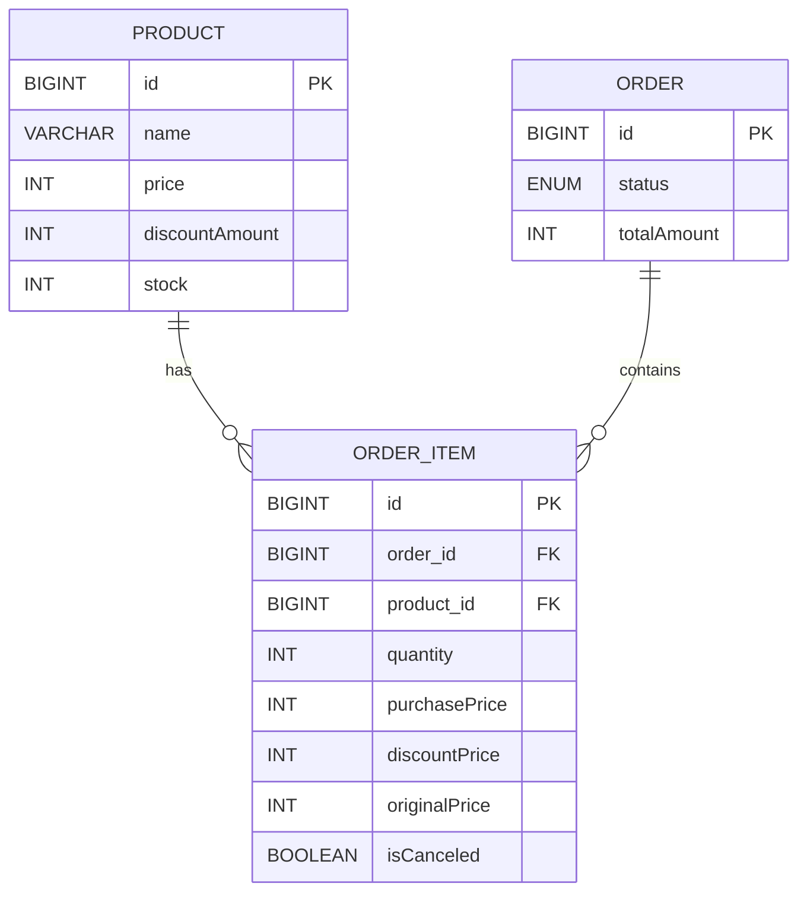
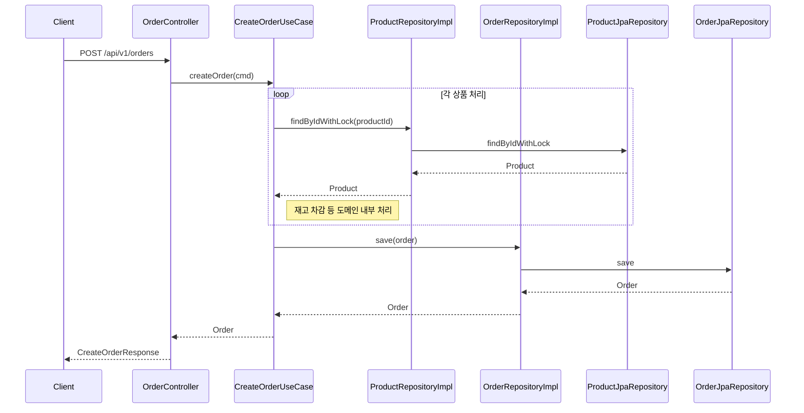
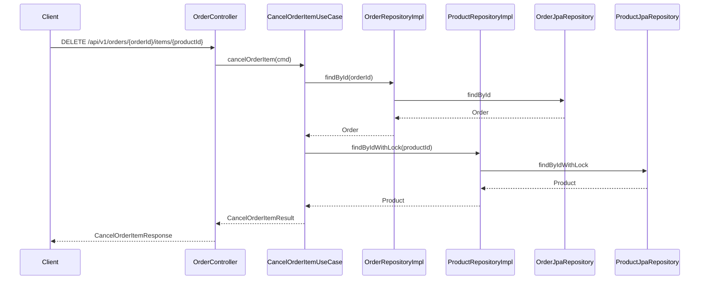
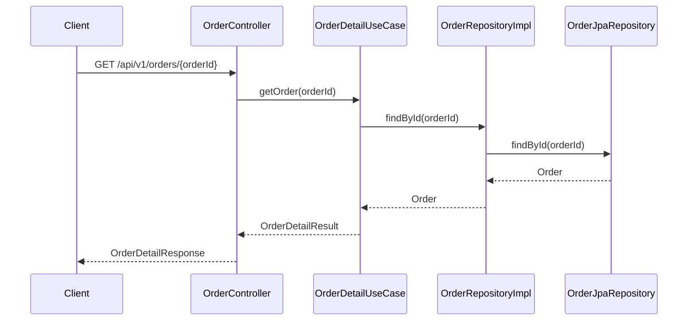

# 주문 서비스 과제

사용자가 여러 상품을 한 번에 주문하고, 개별 상품 취소 및 주문 조회가 가능한 시스템을 구현했습니다.

---

## 요구사항

### 주문 생성 API

- 상품 ID 및 수량 리스트로 주문 생성
- 할인 금액을 반영한 실구매금액 계산
- 재고 부족 시 실패 처리
- 주문 생성 시 재고 차감 처리

### 주문 상품 개별 취소 API

- 주문번호, 상품ID로 개별 취소
- 재고 복구
- 취소 상품 정보, 남은 주문 금액 반환
- 예외 처리: 존재하지 않는 주문/상품, 중복 취소

### 주문 조회 API

- 주문번호로 주문 상품 조회
- 상품 목록, 수량, 실구매금액, 전체 계산 금액 반환
- 예외 처리: 존재하지 않는 주문

---

## 기술 스택

| 구별        | 기술            |
| --------- | ------------- |
| Language  | Java 17       |
| Framework | Spring Boot 3 |
| DB        | H2 (In-memory) |
| ORM       | Spring Data JPA |
| Docs      | Swagger UI    |
| Test      | JUnit5, Mockito |

---

## 멀티 모듈 구조 및 설계

| 모듈명                    | 역할                                     |
| ---------------------- |----------------------------------------|
| `order-api`            | API Controller 및 Swagger 설정 및 공통 응답 처리 |
| `order-service`        | 도메인 모델, UseCase, 비즈니스 로직, 인터페이스, 예외 정의 |
| `order-infrastructure` | JPA 기반 Persistence 구현                  |

##  설계 방향 및 확장성 고려

###  멀티모듈 구조 & 의존성 역전 원칙 (DIP) 적용

- `order-service`는 **핵심 도메인 로직 (UseCase, Entity, 인터페이스 Repository 등)** 을 정의한 모듈입니다.
- **하위 모듈인 `order-infrastructure`에서 JPA를 사용해 실제 구현체를 제공합니다.**
- 이때 **`order-service`는 JPA, DB 등 기술 스택을 전혀 알지 못합니다.**
- 즉,
  `order-service`는 외부 모듈에 의존하지 않으며, `order-api`와 `order-infrastructure`가 `order-service`를 참조하는 구조입니다. 이를 통해 의존성 역전 원칙(DIP)을 실현하고, 서비스 로직의 독립성과 테스트 용이성을 확보했습니다.

#### 구조 요약
               [order-api]
                    |
                    v
              [order-service] <--------------------+
                 ↑                                 |
                 |                                 |
            Repository 인터페이스                구현체 (@Repository)
                 |                                 |
                 +------------- [order-infrastructure]

###  설계 장점

-  **테스트 용이**: `order-service`의 UseCase는 Mockito 등으로 손쉽게 단위 테스트 가능
-  **기술 독립성 확보**: 인프라 교체 (예: RDB → NoSQL, JPA → MyBatis 등) 시 도메인 로직 영향 최소화
-  **유지보수성 향상**: 복잡한 비즈니스 로직과 외부 시스템의 변경을 분리


---

##  ERD



---

##  시퀀스 다이어그램

### 주문 생성



### 주문 상품 취소



### 주문 조회



---

## 테스트 전략


- 각 UseCase의 단위 테스트를 기반으로 테스트 코드를 짰습니다. (JUnit5 + Mockito)
- 비즈니스 로직의 핵심 흐름이 구현된 UseCase 레이어에 대해 JUnit5 + Mockito 기반의 단위 테스트를 작성했습니다. 
- 외부 의존성(Repository)은 모두 Mock 객체로 대체하여 순수 비즈니스 로직의 검증에 집중했습니다.

---

## 실행 방법

```bash
./gradlew clean build
./gradlew :order-api:bootRun
```

접속: [http://localhost:8080/swagger-ui/index.html](http://localhost:8080/swagger-ui/index.html)

